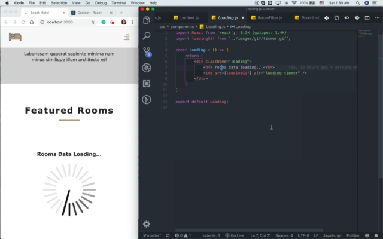
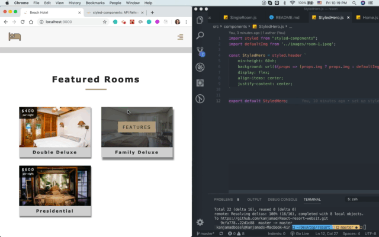
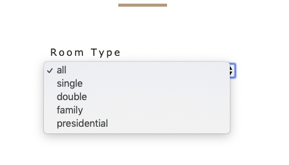
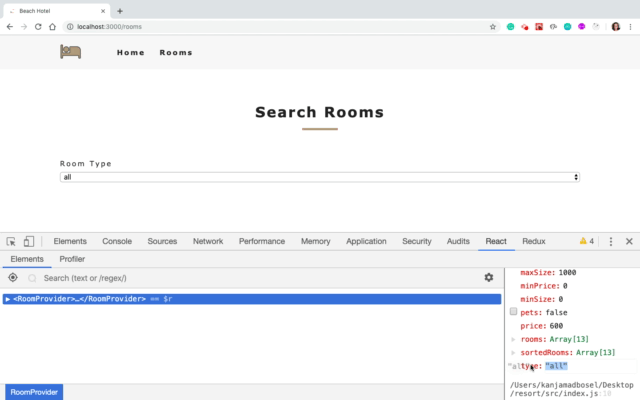

# React Beach Resort Project
* Beach Resort is a full stack mock resort website template that can be sold to clients to display their hotel rooms and have option to filter : room type, number of guests, search by the price, room size, included breakfast , allowed pet … more 
* Used react router for routing and create custom 404 page not found and will have option of click return to home page or can navigate through a navbar
* Used react context API for state management 
* used contentful  headlessCMS for data management
* Full responsive
* Used react icons is very nice features render as a SVG 

## User stories

### Home page
* Have hero component that will have a background image
* In the middle of hero component will have banner that will have link to route to rooms page
* Used react icons to display the services
* Have data for all the rooms in the hotel
* Room component will have price, name, image and when hover the image will have option of click then will navigate to a single room page

### Single room page
* Have information just about the specific room page
* Info : price, size, pets allowed/not allowed, free breakfast included/not included
* Detail: just about the specific for that room

### Rooms page
* Have multiple rooms
* User have option to filter ; Room type, Number of Gueste, Search by the price, Room size and have more filter by check the box breakfask included and pet allowed or just want to looking for the room the allwed pet 
* Search by the price : if you go below the price will have message error notice it say no rooms match


### Navigate to page that doesn't exist
* Used react router
* Create custom 404 page not found 
* Will have option fo click return to home page or can navigate through a navbar

___


## Single room
* forEach
* A Switch renders the first child Route that matches. A Route with no path always matches.

```
<Switch>
<Route exact path="/" component={Home} />
<Route exact path="/rooms" component={Rooms} />
<Route exact path="/rooms/: name variable" component={SingleRoom} />
<Route component={Error} />
</Switch>

```

## Navbar
* Have navbar every page
* app.js pretty much done

```
      <Navbar />
      <Switch>
      <Route exact path="/" component={Home} />
      <Route exact path="/rooms" component={Rooms} />
      <Route exact path="/rooms/:roomName" component={SingleRoom} />
      <Route component={Error} />
      </Switch>

```

## React.createContext API
* Create a Context object
* Access to component
* Provider React component : allows the access to my context all throughout my application
* Context.Consumer : Consumer will lets subscribe to a context within a function component.




## Styled components to styled-Hero
* We can attach styles to the component and it will be right away rendered
* Use javaScript and CSS
* Installation 

```
npm install --save styled-components

```




## Filter Room
### Room filter setup
* set up funtion will only repeat return unique values
* Remove Array Duplicates in ES6 (1.Using set 2.Using filter 3.Using reduce )
* Using  Set data structure

```
//Remove-Array-Duplicates-in-ES6
const array = [1,2,5,2,1,8];

//Step1
const uniqueSet = new Set(array);
// Set{1,2,5,8}

//Step2 ;convert it back to an array by using the spread operator ...
const backToArray = [...unigeSet];
// [1,2,5,8]

```

* Passing  the string it will be check what kind of value you have for the type
* If that value will not be in the Set, will included it
* If in the Set by default Set will not included it 
* And will get all unique values 

```
// get all unique values
      const getUnique = (items, value) => {
      return [...new Set(items.map(item => item[value]))]
}

// get unique types
      let types = getUnique(rooms, 'type');

// add all
      types = ['all',...types];

// map to jsx
      types = types.map((item, index)=> {
            return <option value={item} key={index}> {item} </option>
})
```




### Type filter

* Whatever I'm getting back, doesn't matter whatever type, capacity, price ....
* As long as I name them exactly like I have an a state

```
  state = {
    rooms: [],
    sortedRooms: [],
    featuredRooms: [],
    loading: true,
    type: "all",
    capacity: 1,
    price: 0,
    minPrice: 0,
    maxPrice: 0,
    minSize: 0,
    maxSize: 0,
    breakfast: false,
    pets: false
  };

```

```
 handleChange = event => {
        const target = event.target;
        const value = event.type === 'checkbox'? target.checked : target.value;
        const name = event.target.name;

        this.setState(
            {
                [name] : value
            },
            this.filterRooms
        );
        
    };

```



## Additional Resources
1. <a href="https://www.slightedgecoder.com/2018/12/18/page-not-found-on-netlify-with-react-router/" target="_blank">react-router-dom an netlify</a>
2. <a href="https://reacttraining.com/react-router/web/guides/quick-start" target="_blank">React Router Dom </a>
3. <a href="https://react-icons.netlify.com/#/" target="_blank">React Icons</a>
4. <a href="https://developer.mozilla.org/en-US/docs/Web/CSS/grid-template-columns" target="_blank">grid-template-columns</a>
5. <a href="https://css-tricks.com/snippets/css/complete-guide-grid/" target="_blank">A Complete Guide to Grid</a>
6. <a href="https://reactjs.org/docs/context.html#reactcreatecontext" target="_blank">React.createContext API</a>
7. <a href="https://medium.com/poka-techblog/simplify-your-javascript-use-map-reduce-and-filter-bd02c593cc2d" target="_blank">Simplify your JavaScript – Use .map(), .reduce(), and .filter()</a>
8. <a href="https://icons8.com/preloaders/en/search/2/loading" target="_blank">loading gif</a>
9. <a href="https://reactjs.org/docs/typechecking-with-proptypes.html" target="_blank">Typechecking With PropTypes</a>
10. <a href="https://www.iconfinder.com/" target="_blank">logo icon</a>
11. <a href="https://www.styled-components.com/" target="_blank">Styled components</a>
12. <a href="https://css-tricks.com/auto-sizing-columns-css-grid-auto-fill-vs-auto-fit/" target="_blank">Auto-Sizing Columns in CSS Grid: `auto-fill` vs `auto-fit`</a>
13. <a href="https://www.samanthaming.com/tidbits/43-3-ways-to-remove-array-duplicates" target="_blank">How to Remove Array Duplicates in ES6
</a>
